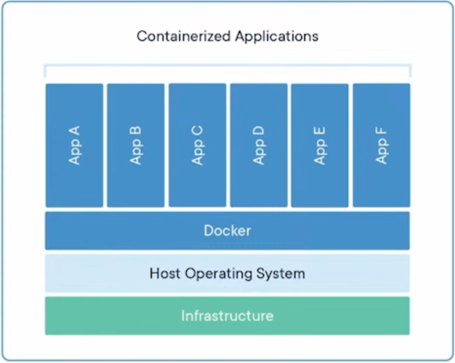

# 도커(Docker)

- 어플리케이션을 컨테이너라는 가볍고 독립적인 환경에서 실행할 수 있도록 도와주는 가상화 플랫폼(오픈소스)
- 외부 환경과 격리된 상태에서 애플리케이션이 환경에 영향 받지 않고 실행될 수 있도록 하는 소프트웨어

## 컨테이너

- 컨테이너(Container)는 어떤 물체나 데이터를 외부와 분리된 공간에 담아두는 것
- 물체를 격리하는 공간과 비슷한 의미
  

### 컨테이너의 필요성

- 환경 차이 없이 어디서든 실행 가능
- 설치/설정 충돌 방지
- 빠른 실행과 이식성

## 도커의 핵심 구성 요소

- 도커 엔진(DOcker Engine)
  - Docker의 중심이 되는 실행 시스템
  - 컨테이너를 실제로 생성하고 실행하는 역할을 맡음
  - dockered 라는 데몬(서버)이 Docker API 요청을 받아 처리

- 도커 클라이언트(Docker Client)
  - 우리가 터미널에서 입력하는 docker명령어가 여기에 할당
  - 사용자가 입력한 명령은 내부적으로 Docker Engine에 전달
  - 실제로 작업을 수행하는 것은 엔진이고, 클라이언트는 이를 요청하는 창구 역할을 함

- 도커 객체(Docker Objects)
  - Docker에서 다루는 주요 구성 단위
  - Image(이미지): 컨테이너를 만들기 위한 설계도 역할
  - Container (컨테이너): 이미지를 실제로 실행한 실체
  - Service(서비스): 여러 개의 컨테이너를 묶음 하나의 서비스처럼 운영하는 단위(Docker Swarm, k8s)

- 도커 레지스토리 (Docker Registry)
  - 이미지를 저장하고 고유할 수 있는 중앙 저장소
  - 가장 대표적인 예는 Docker Hub
  - 사용자는 docker pull로 이미지를 내려 받고, docker push로 자신이 만ㄷ느 이미지를 업로드할 수 있음

## Dockerfile, Docker Image, Docker Container의 관계

- 도커 파일 (Dockerfile)
  - Dockerfile은 이미지를 만들기 위한 설계도
  - 우리가 원하는 환경과 명령들을 스크립트 형식으로 작성한다.
  - ex) 어떤 OS, 어떤 파일을 복사 할지, 어떤 명령어를 실행할지를 기록

```
# [Dockerfile]
FROM node:10.16.3
WORKDIR /app
ADD . /app
RUN npm install
CMD ["npm", "start"]
```

- 도커 이미지 (Docker Iamge)
  - 이미지는 하나의 정적인 파일로, 실행할 준비가 된 상ㅁ태의 환경
  - docker build 명령을통해 Dockerfile로 부터 이미지를 생성
  - 내부에는 다음과 같은 정보가 포함
    - OS(기반 계층, ex: Ubuntu)
    - 소스코드, 의존성, 환경변수, 실행 명령어

- 도커 컨테이너 (DOcker Container)
  - 컨테이너는 이미지의 복사본이 메모리에서 실행중인 상태
  - 이밎를 docker run 하면 컨테이너 생성
  - 내부에서는 실제 애플리케이션이 졸아감
  - 각 컨테이너는 자신만의 파일 시스템과 프로세스를 가짐(다른 컨테이너와 격리)

## 도커 관련 주요 도구

- 도커 컴포즈(Docker Compose)
  - 여러 개의 컨테이너를한 번에 실행하고 관리할 수 있는 도구
  - docker-compose.yml 파일에 컨테이너 구성과 관계를 정의
  - 다른 여러 종류의 서버를 하나의 시스템처러 묶어서 실행

## 도커 사용 사례

- 개발 및 테스트
  - 일관된 개발 환경을 구축
  - 격리된 컨테이너에서 애플리케이션을 빠르게 테스트
- 마이크로서비스 아키텍처
  - 컨테이너에서 서비스를 독립적으로 배포하고 관리
- 지속적 통합/지속적 배포 (CI/CD)
  - 애플리케이션을 바이너리 형태로 빌드한 후 컨테이너 이미지로 패키징하여 업로드
  - 컨테이너 상태 그대로 배포할 수 있음
- 빅테이터 및 머신러닝
  - Spark와 같은 데이터 처리 프레임워크를 위한 환경 구성을 단순화

# Docker 기본 명령어

## 이미지 관련 명령어

| 명령어                             | 설명                       |
| ---------------------------------- | -------------------------- |
| docker search [이름]               | Docker Hub에서 이미지 검색 |
| docker pull [이미지명]             | 이미지 다운로드            |
| docker images 또는 docker image ls | 로컬 이미지 목록 확인      |
| docker rmi [이미지ID/이름]         | 이미지 삭제                |
| docker tag [기존이름] [새이름]     | 이미지에 별칭(tag) 붙이기  |

## 컨테이너 관련 명령어

### 컨테이너 실행 & 관리 명령어

| 명령어                            | 설명                            |
| --------------------------------- | ------------------------------- |
| docker run [이미지]               | 컨테이너 실행                   |
| docker run -it [이미지]           | 대화형 실행 (터미널 접근)       |
| docker run -d [이미지 ]           | 백그라운드 실행 (detached mode) |
| docker run --name [이름] [이미지] | 컨터이너에 이름 부여 후 실행    |
| docker ps                         | 실행 중인 컨테이너 목록         |
| docker ps -a                      | 모든 컨테이너 목록 (종류 포함)  |
| docker stop [이름/ID]             | 컨테이너 정지                   |
| docker restart [이름/ID]          | 컨테이너 재시작                 |
| docker rm [이름/ID]               | 컨테니언 삭제                   |

### 컨테이너 내부 다루기 & 이미지 빌드 명령어

| 명령어                              | 설명                                       |
| ----------------------------------- | ------------------------------------------ |
| docker exec [이름] [명령]           | 실행 중 컨테이너에 명령 실행               |
| docker exec -it [이름] bash         | 접속                                       |
| docker cp [파일] [컨테이너]:[경로}] | 컨테이너에 파일 복사                       |
| docker container stats [이름]       | 컨테이너 리소스 사용량 확인                |
| docker build -t [이미지 이름] .     | 현재 디렉토리에서 Dockerfile로 이미지 생성 |

# Docker Compose

## Docker Compose란?

- Docker Compose는 여러 컨테이너를 하나의 프로젝트처럼 관리할 수 있게 해주는 도구
- docker-compose.yml 파일에 정의된 내용을 바탕으로 하나에 컨테이너들을 실행

## docker-compose.yml구조

```
services:
  web:
    image: nginx
    ports:
      - "8080:80"
  db:
    image: mongo
```

- services: 컨테이너 목록
- image: 사용할 도커 이미지
- ports: 호스트와 컨테이너의 포트 매핑

## Docker compose 명령어

- docker compose up -d : 백그라운드 실행
- docker compose ps : 실행중인 서비스 확인
- docker compose down : 컨테이너, 네트워크 확인

## 자주 쓰이는 docker-compose.yml 문법

| 키워드         | 용도                                                                                     | 예시                                  |
| -------------- | ---------------------------------------------------------------------------------------- | ------------------------------------- |
| services       | 실행할 컨테이너(서비스)들을 정의하는 취상위 키, 각 서비스별로 이미지, 포트, 볼륨 등 설정 | services: web: ..                     |
| image          | 사용할 도커 이미지를 지정                                                                | image:nginx:latest                    |
| build          | 로컬 Dockerfile로 이미지를 직접 빌드할 때 사용                                           | build:./app                           |
| container_name | 컨테이너이름을 직접 지정 (안 하면 자동 생성됨)                                           | container_name: my_ap                 |
| ports          | 호스트 <-> 컨테이너 포트 연결. "호스트:컨테이너" 형식                                    | ports:-"8080:80"                      |
| volumes        | 데이터 공유/저장. 로컬 디렉토리를 컨테이너에 마운트하거나 볼륨 이름을 지정               | volumes:- ./data:/var/lib/mysql       |
| enviroment     | 컨테이너 내부 환경 변수 직접 지정                                                        | enviroment: -MYSQL_ROOT_PASSWORD=1234 |
| env_file       | .env 파일에서 환경 변수 한꺼번에 가져오기                                                | env_file: - .env                      |
| command        | 컨테이너 시작 시 실행할 명령어(Dockerfile의 CMD를 덮어씀)                                | command: python app.py                |

### 상위 키워드

| 키워드   | 용도                                                       | 예시                  |
| -------- | ---------------------------------------------------------- | --------------------- |
| volumes  | 여러 서비스가 공유하는 데이터 볼륨 정의                    | volumes: db_data:     |
| networks | 사용자 정의 네트워크 생성(컨테이너 간 별도 통신망 필요 시) | networks: my_network: |

## 자주쓰이는 Docker Compose 명령어

| 명령어                 | 용도                                                                        | 예시                                  |
| ---------------------- | --------------------------------------------------------------------------- | ------------------------------------- |
| docker compose up      | docker-compose.yml에 정의된 컨테이너를 생성-시작 (-d 옵션: 백그라운드 실행) | docker compose up -d                  |
| docker compose down    | 실행중인 모든 컨테이너, 네트워크, 볼륨, 중단 및 삭제                        | docker compose down                   |
| docker compose ps      | 현재 Compose로 실행 중인 컨테이너 상태 확인                                 | docker compose ps                     |
| docker compose logs    | 컨테이너 로그 출력 (-f 옵션: 실시간 로그)                                   | docker compose logs -f                |
| docker compose stop    | 컨테이너 중지 (삭제 X)                                                      | docker compose stop                   |
| docker compose start   | 중지된 컨테이너 재식작                                                      | docker compose starat                 |
| docker compose restart | 컨테이너 재시작                                                             | docker compose restart                |
| docker compose build   | Dockerfile 기반으로 이미지 빌드                                             | docker compose build                  |
| docker compose exec    | 실행중인 컨테이너에서 명령어 실행                                           | docker compose exec <서비스명> <명령> |
| docker compose run     | 새로운 일회성 컨테이너 실행                                                 | docker compose run --rm web sh        |
